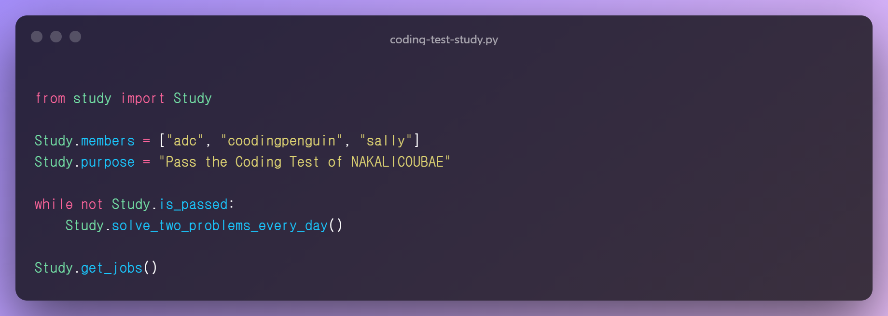

  <h1>👨‍💻Coding Test Study👩‍💻</h1>
  
   
  
  
  

---

- [팀원 소개](#팀원-소개)
- [스터디 방식](#스터디-방식)
- [이용 규칙](#이용-규칙)
  - [Naming](#naming)
  - [Pull Request](#pull-request)
  - [Issue](#issue)
- [스터디 일지](#스터디-일지)

---

## 팀원 소개

<table>
    <tr height="160px">
        <td align="center" width="150px">
            
             
            <strong>펭귄</strong>
        </td>
        <td align="center" width="150px">
            
             
            <strong>샐리</strong>
        </td>
        <td align="center" width="150px">
            
             
            <strong>원딜</strong>
        </td>
        <td align="center" width="150px">
            
             
            <strong>후미</strong>
        </td>
    </tr>
    <tr height="50px">
        <td align="center">
            <a href="https://github.com/coodingpenguin">:octocat: GitHub</a>
             
            <a href="./coodingpenguin">:memo: 푼 문제들</a>
        </td>
        <td align="center">
            <a href="https://github.com/bsm8734">:octocat: GitHub</a>
             
            <a href="./sally">:memo: 푼 문제들</a>
        <td align="center">
            <a href="https://github.com/changwoomon">:octocat: GitHub</a>
             
            <a href="./changwoomon">:memo: 푼 문제들</a>
        </td>
        <td align="center">
            <a href="https://github.com/opijae">:octocat: GitHub</a>
             
            <a href="./opijae">:memo: 푼 문제들</a>
        </td>
    <tr height="160px">
        <td align="center" width="150px">
            
             
            <strong>구너</strong>
        </td>
        <td align="center" width="150px">
            
             
            <strong>튜브</strong>
        </td>
        <td align="center" width="150px">
            
             
            <strong>감자</strong>
        </td>
        <td align="center" width="150px">
        </td>
    </tr>
    <tr height="50px">
        <td align="center">
            <a href="https://github.com/osmosm7">:octocat: GitHub</a>
             
            <a href="./osmosm7">:memo: 푼 문제들</a>
        </td>
        <td align="center">
            <a href="https://github.com/peacecheejecake">:octocat: GitHub</a>
             
            <a href="./sally">:memo: 푼 문제들</a>
        <td align="center">
            <a href="hhttps://github.com/dkswndms4782">:octocat: GitHub</a>
             
            <a href="./changwoomon">:memo: 푼 문제들</a>
        </td>
        <td align="center">
        </td>
    </tr>
</table>

---

## 스터디 방식

> [tony9402님의 백준 문제집](https://github.com/tony9402/baekjoon)을 가지고 스터디를 진행합니다.

- 팀원과 상의하여 완전히 습득할 유형을 정한다.
- 매일 두 문제씩 해당 유형의 문제를 푼다. 순서는 문제집에 있는 순서를 그대로 따른다.
- 자신의 닉네임으로 된 브랜치에 푼 문제의 코드를 Commit하고 Pull Request를 보낸다.
  - Pull Request에는 **문제 링크, 간단한 풀이 방식, 궁금한 사항**을 적는다.
  - 제대로 제출했다면 나머지 팀원들이 확인하고 승인을 한다. 만약 Pull Request 양식을 지키지 않을 시 거절한다.
  - Pull Request에 질문이 있다면 해당 내용에 대한 답변을 작성한다. 역으로 질문하는 것도 가능하다.
- 공부를 하면서 새로 배운 개념, 좋은 꿀팁은 Issue에 공유한다.
- Pull Request 제출 마감은 **해가 뜨기 전까지**이며, 못 푼 문제 수만큼 1000원의 벌금을 부과한다.
  - **[🌞 해 뜨는 시간 확인하기!](https://www.google.com/search?q=%EC%9D%BC%EC%B6%9C%EC%8B%9C%EA%B0%84)**
- **`2021.05.27`** 코딩테스트 스터디는 **평일에만** 진행하며, 주말은 쉰다.
- **`2021.07.16`** 다양한 문제 풀이를 위해 최고 난이도는 **골드3🥇**로 설정한다.
- **`2021.07.09`** 난이도에 상관 없이 **하루에 두 문제씩** 푼다.

---

## 이용 규칙

### Naming

- 폴더는 자신의 닉네임으로된 폴더만 이용합니다.
- 서브 폴더로 유형을 이름으로 한 폴더를 생성합니다.
  - **ex.** 그래프 탐색 → `graph_traversal`
- 서브 폴더 안에 푼 문제의 이름은 `문제번호_문제제목.py`, `문제번호_문제제목.cpp`로 통일합니다. 띄어쓰기가 있으면 띄어쓰기를 제외하고 작성합니다. 문제 번호와 문제 제목은 <strong>[스터디 일지](#스터디-일지)</strong>에서 확인할 수 있습니다.
  - **ex.** 백준 2606번 바이러스 → `2606_바이러스.py`
  - **ex.** 백준 1260번 DFS와 BFS → `1260_DFS와BFS.py`
- 자신의 폴더 내 README는 자유롭게 작성하셔도 됩니다.

### Pull Request

- Pull Request 제목은 `[닉네임] 날짜`로 해주세요!
  - 5월 10일 펭귄 → `[펭귄] 2021.05.10`
- 자신의 닉네임으로 된 브랜치를 딴 후 자신의 닉네임 폴더에 코드를 추가한 후 Pull Request를 보냅니다.
- Pull Request 양식에 따라 작성해야 하며, 제대로 작성하지 않을 시 승인이 되지 않습니다.

### Issue

- 문제를 풀면서 새로 배운 개념을 간단히 정리하거나 문제 풀이 시 꿀팁을 공유하는 공간입니다.
- 메인 태그로는 **concept**과 **tips**가 있으며, concept은 개념 정리, tips는 꿀팁을 공유할 때 다는 태그입니다.
- 서브 태그는 자유롭게 붙여주시되 색깔은 `#efefef`로 설정하고 모두 영어로 작성합니다.
  - 미리 몇 개의 서브 태그를 만들어 놓았으니 서브 태그에 없다면 직접 만들어주세요.

---

## 스터디 일지

<strong>그래프 탐색 (2021.05.10 ~ 2021.05.23)</strong>

 

- **`5/18 - 5/20`** 부스트캠프 AI Tech P-Stage 3 대회 마지막 주로 대회 참여로 휴식
- **`5/24 - 5/26`** 재정비 시간을 갖고자 휴식

| 날짜 |                                 문제 번호                                 |                                       문제 이름                                        |                                          난이도                                          |
| :--: | :-----------------------------------------------------------------------: | :------------------------------------------------------------------------------------: | :--------------------------------------------------------------------------------------: |
| 5/10 |  <a href="https://www.acmicpc.net/problem/2606" target="_blank">2606</a>  |      <a href="https://www.acmicpc.net/problem/2606" target="_blank">바이러스</a>       |         |
| 5/10 |  <a href="https://www.acmicpc.net/problem/1260" target="_blank">1260</a>  |      <a href="https://www.acmicpc.net/problem/1260" target="_blank">DFS와 BFS</a>      |  |
| 5/11 | <a href="https://www.acmicpc.net/problem/11725" target="_blank">11725</a> |  <a href="https://www.acmicpc.net/problem/11725" target="_blank">트리의 부모 찾기</a>  |  |
| 5/11 |  <a href="https://www.acmicpc.net/problem/1325" target="_blank">1325</a>  |    <a href="https://www.acmicpc.net/problem/1325" target="_blank">효율적인 해킹</a>    |  |
| 5/12 |  <a href="https://www.acmicpc.net/problem/2178" target="_blank">2178</a>  |      <a href="https://www.acmicpc.net/problem/2178" target="_blank">미로 탐색</a>      |        |
| 5/12 |  <a href="https://www.acmicpc.net/problem/2667" target="_blank">2667</a>  |   <a href="https://www.acmicpc.net/problem/2667" target="_blank">단지번호붙이기</a>    |        |
| 5/13 |  <a href="https://www.acmicpc.net/problem/7576" target="_blank">7576</a>  |       <a href="https://www.acmicpc.net/problem/7576" target="_blank">토마토</a>        |        |
| 5/13 |  <a href="https://www.acmicpc.net/problem/7569" target="_blank">7569</a>  |       <a href="https://www.acmicpc.net/problem/7569" target="_blank">토마토</a>        |        |
| 5/14 | <a href="https://www.acmicpc.net/problem/16918" target="_blank">16918</a> |       <a href="https://www.acmicpc.net/problem/16918" target="_blank">봄버맨</a>       |        |
| 5/14 |  <a href="https://www.acmicpc.net/problem/5547" target="_blank">5547</a>  |    <a href="https://www.acmicpc.net/problem/5547" target="_blank">일루미네이션</a>     |        |
| 5/15 | <a href="https://www.acmicpc.net/problem/14502" target="_blank">14502</a> |       <a href="https://www.acmicpc.net/problem/14502" target="_blank">연구소</a>       |        |
| 5/15 | <a href="https://www.acmicpc.net/problem/16234" target="_blank">16234</a> |     <a href="https://www.acmicpc.net/problem/16234" target="_blank">인구 이동</a>      |        |
| 5/16 |  <a href="https://www.acmicpc.net/problem/2636" target="_blank">2636</a>  |        <a href="https://www.acmicpc.net/problem/2636" target="_blank">치즈</a>         |        |
| 5/16 | <a href="https://www.acmicpc.net/problem/13549" target="_blank">13549</a> |     <a href="https://www.acmicpc.net/problem/13549" target="_blank">숨바꼭질 3</a>     |        |
| 5/17 |  <a href="https://www.acmicpc.net/problem/1600" target="_blank">1600</a>  | <a href="https://www.acmicpc.net/problem/1600" target="_blank">말이 되고픈 원숭이</a>  |        |
| 5/17 | <a href="https://www.acmicpc.net/problem/17836" target="_blank">17836</a> |  <a href="https://www.acmicpc.net/problem/17836" target="_blank">공주님을 구해라!</a>  |        |
| 5/21 | <a href="https://www.acmicpc.net/problem/16973" target="_blank">16973</a> |   <a href="https://www.acmicpc.net/problem/16973" target="_blank">직사각형 탈출</a>    |        |
| 5/21 | <a href="https://www.acmicpc.net/problem/14940" target="_blank">14940</a> |   <a href="https://www.acmicpc.net/problem/14940" target="_blank">쉬운 최단거리</a>    |        |
| 5/22 | <a href="https://www.acmicpc.net/problem/18513" target="_blank">18513</a> |        <a href="https://www.acmicpc.net/problem/18513" target="_blank">샘터</a>        |        |
| 5/22 |  <a href="https://www.acmicpc.net/problem/2668" target="_blank">2668</a>  |     <a href="https://www.acmicpc.net/problem/2668" target="_blank">숫자고르기</a>      |        |
| 5/23 | <a href="https://www.acmicpc.net/problem/13023" target="_blank">13023</a> |       <a href="https://www.acmicpc.net/problem/13023" target="_blank">ABCDE</a>        |        |
| 5/23 | <a href="https://www.acmicpc.net/problem/16954" target="_blank">16954</a> | <a href="https://www.acmicpc.net/problem/16954" target="_blank">움직이는 미로 탈출</a> |        |

<strong>문자열 (2021.05.31 ~ 2021.06.10)</strong>

 

| 날짜 |                                 문제 번호                                 |                                           문제 이름                                           |                                       난이도                                       |
| :--: | :-----------------------------------------------------------------------: | :-------------------------------------------------------------------------------------------: | :--------------------------------------------------------------------------------: |
| 5/31 |  <a href="https://www.acmicpc.net/problem/3029" target="_blank">3029</a>  |            <a href="https://www.acmicpc.net/problem/3029" target="_blank">경고</a>            |   |
| 5/31 | <a href="https://www.acmicpc.net/problem/11720" target="_blank">11720</a> |         <a href="https://www.acmicpc.net/problem/11720" target="_blank">숫자의 합</a>         |   |
| 6/01 | <a href="https://www.acmicpc.net/problem/11365" target="_blank">11365</a> |        <a href="https://www.acmicpc.net/problem/11365" target="_blank">!밀비 급일</a>         |   |
| 6/01 |  <a href="https://www.acmicpc.net/problem/9046" target="_blank">9046</a>  |           <a href="https://www.acmicpc.net/problem/9046" target="_blank">복호화</a>           |   |
| 6/02 | <a href="https://www.acmicpc.net/problem/10798" target="_blank">10798</a> |         <a href="https://www.acmicpc.net/problem/10798" target="_blank">세로읽기</a>          |   |
| 6/02 | <a href="https://www.acmicpc.net/problem/20154" target="_blank">20154</a> | <a href="https://www.acmicpc.net/problem/20154" target="_blank">이 구역의 승자는 누구야?!</a> |   |
| 6/03 |  <a href="https://www.acmicpc.net/problem/6550" target="_blank">6550</a>  |        <a href="https://www.acmicpc.net/problem/6550" target="_blank">부분 문자열</a>         |   |
| 6/03 |  <a href="https://www.acmicpc.net/problem/1316" target="_blank">1316</a>  |       <a href="https://www.acmicpc.net/problem/1316" target="_blank">그룹 단어 체커</a>       |   |
| 6/04 |  <a href="https://www.acmicpc.net/problem/1181" target="_blank">1181</a>  |         <a href="https://www.acmicpc.net/problem/1181" target="_blank">단어 정렬</a>          |   |
| 6/04 |  <a href="https://www.acmicpc.net/problem/4659" target="_blank">4659</a>  |     <a href="https://www.acmicpc.net/problem/4659" target="_blank">비밀번호 발음하기</a>      |   |
| 6/07 | <a href="https://www.acmicpc.net/problem/16171" target="_blank">16171</a> | <a href="https://www.acmicpc.net/problem/16171" target="_blank">나는 친구가 적다 (Small)</a>  |   |
| 6/07 |  <a href="https://www.acmicpc.net/problem/9342" target="_blank">9342</a>  |           <a href="https://www.acmicpc.net/problem/9342" target="_blank">염색체</a>           |   |
| 6/08 |  <a href="https://www.acmicpc.net/problem/1764" target="_blank">1764</a>  |           <a href="https://www.acmicpc.net/problem/1764" target="_blank">듣보잡</a>           |   |
| 6/08 | <a href="https://www.acmicpc.net/problem/20291" target="_blank">20291</a> |         <a href="https://www.acmicpc.net/problem/20291" target="_blank">파일 정리</a>         |   |
| 6/09 | <a href="https://www.acmicpc.net/problem/17413" target="_blank">17413</a> |       <a href="https://www.acmicpc.net/problem/17413" target="_blank">단어 뒤집기 2</a>       |   |
| 6/09 | <a href="https://www.acmicpc.net/problem/17609" target="_blank">17609</a> |           <a href="https://www.acmicpc.net/problem/17609" target="_blank">회문</a>            |  |
| 6/10 | <a href="https://www.acmicpc.net/problem/20437" target="_blank">20437</a> |       <a href="https://www.acmicpc.net/problem/20437" target="_blank">문자열 게임 2</a>       |  |

<strong>트리 (2021.06.11 ~ 2021.06.18)</strong>

 

| 날짜 |                                 문제 번호                                 |                                      문제 이름                                       |                                          난이도                                          |
| :--: | :-----------------------------------------------------------------------: | :----------------------------------------------------------------------------------: | :--------------------------------------------------------------------------------------: |
| 6/11 |  <a href="https://www.acmicpc.net/problem/9934" target="_blank">9934</a>  |  <a href="https://www.acmicpc.net/problem/9934" target="_blank">완전 이진 트리</a>   |  |
| 6/11 | <a href="https://www.acmicpc.net/problem/11725" target="_blank">11725</a> | <a href="https://www.acmicpc.net/problem/11725" target="_blank">트리의 부모 찾기</a> |  |
| 6/14 |  <a href="https://www.acmicpc.net/problem/1991" target="_blank">1991</a>  |     <a href="https://www.acmicpc.net/problem/1991" target="_blank">트리 순회</a>     |        |
| 6/14 |  <a href="https://www.acmicpc.net/problem/5639" target="_blank">5639</a>  |  <a href="https://www.acmicpc.net/problem/5639" target="_blank">이진 검색 트리</a>   |        |
| 6/15 |  <a href="https://www.acmicpc.net/problem/1068" target="_blank">1068</a>  |       <a href="https://www.acmicpc.net/problem/1068" target="_blank">트리</a>        |        |
| 6/16 |  <a href="https://www.acmicpc.net/problem/6416" target="_blank">6416</a>  |     <a href="https://www.acmicpc.net/problem/6416" target="_blank">트리인가?</a>     |        |
| 6/17 | <a href="https://www.acmicpc.net/problem/14675" target="_blank">14675</a> | <a href="https://www.acmicpc.net/problem/14675" target="_blank">단절점과 단절선</a>  |        |
| 6/18 | <a href="https://www.acmicpc.net/problem/17073" target="_blank">17073</a> |  <a href="https://www.acmicpc.net/problem/17073" target="_blank">나무 위의 빗물</a>  |        |

<strong>동적계획법 1 (2021.06.21 ~ 2021.07.07)</strong>

 

| 날짜 |                                 문제 번호                                 |                                           문제 이름                                            |                                          난이도                                          |
| :--: | :-----------------------------------------------------------------------: | :--------------------------------------------------------------------------------------------: | :--------------------------------------------------------------------------------------: |
| 6/21 | <a href="https://www.acmicpc.net/problem/10870" target="_blank">10870</a> |       <a href="https://www.acmicpc.net/problem/10870" target="_blank">피보나치 수 5</a>        |         |
| 6/21 |  <a href="https://www.acmicpc.net/problem/2839" target="_blank">2839</a>  |          <a href="https://www.acmicpc.net/problem/2839" target="_blank">설탕 배달</a>          |         |
| 6/22 |  <a href="https://www.acmicpc.net/problem/2748" target="_blank">2748</a>  |        <a href="https://www.acmicpc.net/problem/2748" target="_blank">피보나치 수 2</a>        |         |
| 6/22 |  <a href="https://www.acmicpc.net/problem/1010" target="_blank">1010</a>  |          <a href="https://www.acmicpc.net/problem/1010" target="_blank">다리 놓기</a>          |         |
| 6/23 |  <a href="https://www.acmicpc.net/problem/9655" target="_blank">9655</a>  |           <a href="https://www.acmicpc.net/problem/9655" target="_blank">돌 게임</a>           |         |
| 6/23 | <a href="https://www.acmicpc.net/problem/17626" target="_blank">17626</a> |        <a href="https://www.acmicpc.net/problem/17626" target="_blank">Four Squares</a>        |         |
| 6/24 |  <a href="https://www.acmicpc.net/problem/1463" target="_blank">1463</a>  |         <a href="https://www.acmicpc.net/problem/1463" target="_blank">1로 만들기</a>          |         |
| 6/24 |  <a href="https://www.acmicpc.net/problem/9095" target="_blank">9095</a>  |       <a href="https://www.acmicpc.net/problem/9095" target="_blank">1, 2, 3 더하기</a>        |         |
| 6/25 | <a href="https://www.acmicpc.net/problem/11726" target="_blank">11726</a> |         <a href="https://www.acmicpc.net/problem/11726" target="_blank">2×n 타일링</a>         |         |
| 6/25 |  <a href="https://www.acmicpc.net/problem/2579" target="_blank">2579</a>  |         <a href="https://www.acmicpc.net/problem/2579" target="_blank">계단 오르기</a>         |         |
| 6/28 | <a href="https://www.acmicpc.net/problem/11727" target="_blank">11727</a> |        <a href="https://www.acmicpc.net/problem/11727" target="_blank">2×n 타일링 2</a>        |         |
| 6/28 | <a href="https://www.acmicpc.net/problem/11053" target="_blank">11053</a> | <a href="https://www.acmicpc.net/problem/11053" target="_blank">가장 긴 증가하는 부분 수열</a> |  |
| 6/29 |  <a href="https://www.acmicpc.net/problem/1912" target="_blank">1912</a>  |           <a href="https://www.acmicpc.net/problem/1912" target="_blank">연속합</a>            |  |
| 6/29 |  <a href="https://www.acmicpc.net/problem/9465" target="_blank">9465</a>  |           <a href="https://www.acmicpc.net/problem/9465" target="_blank">스티커</a>            |  |
| 6/30 | <a href="https://www.acmicpc.net/problem/11055" target="_blank">11055</a> |   <a href="https://www.acmicpc.net/problem/11055" target="_blank">가장 큰 증가 부분 수열</a>   |  |
| 6/30 |  <a href="https://www.acmicpc.net/problem/1890" target="_blank">1890</a>  |            <a href="https://www.acmicpc.net/problem/1890" target="_blank">점프</a>             |  |
| 7/01 |  <a href="https://www.acmicpc.net/problem/2407" target="_blank">2407</a>  |            <a href="https://www.acmicpc.net/problem/2407" target="_blank">조합</a>             |  |
| 7/01 |  <a href="https://www.acmicpc.net/problem/1106" target="_blank">1106</a>  |            <a href="https://www.acmicpc.net/problem/1106" target="_blank">호텔</a>             |  |
| 7/02 | <a href="https://www.acmicpc.net/problem/15486" target="_blank">15486</a> |           <a href="https://www.acmicpc.net/problem/15486" target="_blank">퇴사 2</a>           |        |
| 7/02 |  <a href="https://www.acmicpc.net/problem/2156" target="_blank">2156</a>  |         <a href="https://www.acmicpc.net/problem/2156" target="_blank">포도주 시식</a>         |        |
| 7/05 | <a href="https://www.acmicpc.net/problem/10844" target="_blank">10844</a> |        <a href="https://www.acmicpc.net/problem/10844" target="_blank">쉬운 계단 수</a>        |        |
| 7/05 |  <a href="https://www.acmicpc.net/problem/2293" target="_blank">2293</a>  |           <a href="https://www.acmicpc.net/problem/2293" target="_blank">동전 1</a>            |        |
| 7/06 |  <a href="https://www.acmicpc.net/problem/2294" target="_blank">2294</a>  |           <a href="https://www.acmicpc.net/problem/2294" target="_blank">동전 2</a>            |        |
| 7/06 | <a href="https://www.acmicpc.net/problem/11660" target="_blank">11660</a> |      <a href="https://www.acmicpc.net/problem/11660" target="_blank">구간 합 구하기 5</a>      |        |
| 7/07 | <a href="https://www.acmicpc.net/problem/21317" target="_blank">21317</a> |      <a href="https://www.acmicpc.net/problem/21317" target="_blank">징검다리 건너기</a>       |        |

<strong>최단거리 (2021.07.09 ~ 2021.07.13)</strong>

 

| 날짜 |                                 문제 번호                                 |                                         문제 이름                                         |                                          난이도                                          |
| :--: | :-----------------------------------------------------------------------: | :---------------------------------------------------------------------------------------: | :--------------------------------------------------------------------------------------: |
| 7/09 | <a href="https://www.acmicpc.net/problem/18352" target="_blank">18352</a> | <a href="https://www.acmicpc.net/problem/18352" target="_blank">특정 거리의 도시 찾기</a> |  |
| 7/09 | <a href="https://www.acmicpc.net/problem/11403" target="_blank">11403</a> |       <a href="https://www.acmicpc.net/problem/11403" target="_blank">경로 찾기</a>       |        |
| 7/12 |  <a href="https://www.acmicpc.net/problem/2224" target="_blank">2224</a>  |       <a href="https://www.acmicpc.net/problem/2224" target="_blank">명제 증명</a>        |        |
| 7/12 | <a href="https://www.acmicpc.net/problem/11265" target="_blank">11265</a> |   <a href="https://www.acmicpc.net/problem/11265" target="_blank">끝나지 않는 파티</a>    |        |
| 7/13 |  <a href="https://www.acmicpc.net/problem/1753" target="_blank">1753</a>  |        <a href="https://www.acmicpc.net/problem/1753" target="_blank">최단경로</a>        |        |
| 7/13 | <a href="https://www.acmicpc.net/problem/13549" target="_blank">13549</a> |      <a href="https://www.acmicpc.net/problem/13549" target="_blank">숨바꼭질 3</a>       |        |

<strong>구현 (2021.07.14 ~ 2021.07.27)</strong>

 

| 날짜 |                                 문제 번호                                 |                                             문제 이름                                             |                                       난이도                                       |
| :--: | :-----------------------------------------------------------------------: | :-----------------------------------------------------------------------------------------------: | :--------------------------------------------------------------------------------: |
| 7/14 |  <a href="https://www.acmicpc.net/problem/1913" target="_blank">1913</a>  |             <a href="https://www.acmicpc.net/problem/1913" target="_blank">달팽이</a>             |   |
| 7/14 | <a href="https://www.acmicpc.net/problem/14467" target="_blank">14467</a> |    <a href="https://www.acmicpc.net/problem/14467" target="_blank">소가 길을 건너간 이유 1</a>    |   |
| 7/15 | <a href="https://www.acmicpc.net/problem/12933" target="_blank">12933</a> |             <a href="https://www.acmicpc.net/problem/12933" target="_blank">오리</a>              |   |
| 7/15 |  <a href="https://www.acmicpc.net/problem/2578" target="_blank">2578</a>  |              <a href="https://www.acmicpc.net/problem/2578" target="_blank">빙고</a>              |   |
| 7/16 |  <a href="https://www.acmicpc.net/problem/4396" target="_blank">4396</a>  |           <a href="https://www.acmicpc.net/problem/4396" target="_blank">지뢰 찾기</a>            |   |
| 7/16 |  <a href="https://www.acmicpc.net/problem/1244" target="_blank">1244</a>  |        <a href="https://www.acmicpc.net/problem/1244" target="_blank">스위치 켜고 끄기</a>        |   |
| 7/19 | <a href="https://www.acmicpc.net/problem/10994" target="_blank">10994</a> |         <a href="https://www.acmicpc.net/problem/10994" target="_blank">별 찍기 - 19</a>          |   |
| 7/19 | <a href="https://www.acmicpc.net/problem/20291" target="_blank">20291</a> |           <a href="https://www.acmicpc.net/problem/20291" target="_blank">파일 정리</a>           |   |
| 7/20 | <a href="https://www.acmicpc.net/problem/20436" target="_blank">20436</a> |            <a href="https://www.acmicpc.net/problem/20436" target="_blank">ZOAC 3</a>             |   |
| 7/20 | <a href="https://www.acmicpc.net/problem/17413" target="_blank">17413</a> |         <a href="https://www.acmicpc.net/problem/17413" target="_blank">단어 뒤집기 2</a>         |   |
| 7/21 |  <a href="https://www.acmicpc.net/problem/2615" target="_blank">2615</a>  |              <a href="https://www.acmicpc.net/problem/2615" target="_blank">오목</a>              |   |
| 7/21 | <a href="https://www.acmicpc.net/problem/16926" target="_blank">16926</a> |         <a href="https://www.acmicpc.net/problem/16926" target="_blank">배열 돌리기 1</a>         |   |
| 7/22 | <a href="https://www.acmicpc.net/problem/15787" target="_blank">15787</a> | <a href="https://www.acmicpc.net/problem/15787" target="_blank">기차가 어둠을 헤치고 은하수를</a> |   |
| 7/22 | <a href="https://www.acmicpc.net/problem/17276" target="_blank">17276</a> |          <a href="https://www.acmicpc.net/problem/17276" target="_blank">배열 돌리기</a>          |  |
| 7/23 | <a href="https://www.acmicpc.net/problem/20207" target="_blank">20207</a> |             <a href="https://www.acmicpc.net/problem/20207" target="_blank">달력</a>              |  |
| 7/23 | <a href="https://www.acmicpc.net/problem/21608" target="_blank">21608</a> |         <a href="https://www.acmicpc.net/problem/21608" target="_blank">상어 초등학교</a>         |  |
| 7/26 | <a href="https://www.acmicpc.net/problem/20164" target="_blank">20164</a> |        <a href="https://www.acmicpc.net/problem/20164" target="_blank">홀수 홀릭 호석</a>         |  |
| 7/26 | <a href="https://www.acmicpc.net/problem/14719" target="_blank">14719</a> |             <a href="https://www.acmicpc.net/problem/14719" target="_blank">빗물</a>              |  |
| 7/27 | <a href="https://www.acmicpc.net/problem/16719" target="_blank">16719</a> |             <a href="https://www.acmicpc.net/problem/16719" target="_blank">ZOAC</a>              |  |

